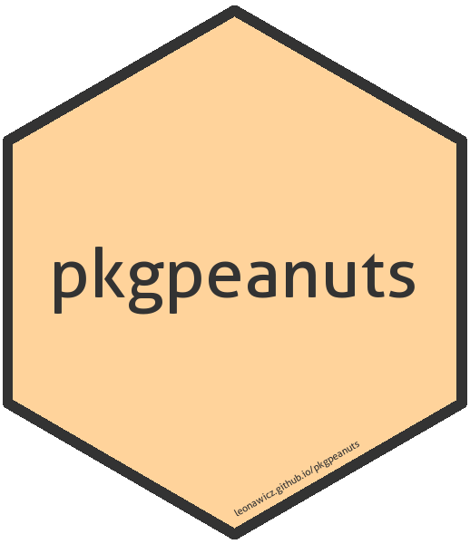

<!-- README.md is generated from README.Rmd. Please edit that file -->

```{r setup, include=FALSE}
knitr::opts_chunk$set(
  collapse = TRUE, comment = "#>", fig.path = "man/figures/README-", eval = TRUE,
  message = FALSE, warning = FALSE, error = FALSE, tidy = TRUE
)
```

# pkgpeanuts 
**Author:** [Matthew Leonawicz](https://leonawicz.github.io/blog/) <a href="https://orcid.org/0000-0001-9452-2771" target="orcid.widget">
<image class="orcid" src="https://members.orcid.org/sites/default/files/vector_iD_icon.svg" height="16"></a>
[](https://gitter.im/leonawicz/pkgpeanuts)
<br/>
**License:** [MIT](https://opensource.org/licenses/MIT)<br/>

[](https://travis-ci.org/leonawicz/pkgpeanuts)
[](https://ci.appveyor.com/project/leonawicz/pkgpeanuts)
[](https://codecov.io/github/leonawicz/pkgpeanuts?branch=master)

The intent of `pkgpeanuts` is to automate building out robust R package scaffolding for a newly created package. Create a new R package project with git in RStudio. Then let `pkgpeanuts` take care of the rest.

This package is in early development. It is not intended for operating on existing, developed packages; only new packages as newly created RStudio projects. It also does not work yet for creating new packages itself (difficulties with git and Windows), hence the instruction about creating a new project in RStudio first. *Use at your own risk and/or read the source code.*

```{r is_md, echo=FALSE}
is_md <- knitr::opts_knit$get("rmarkdown.pandoc.to") == "markdown_github-ascii_identifiers"
```

## Installation

You can install the development version of `pkgpeanuts` from GitHub with:

``` r
# install.packages("remotes")
remotes::install_github("leonawicz/pkgpeanuts")
```

## Package setup

After creating a new local package project with git in RStudio, call `pkgpeanuts::pour` from the package root directory with your desired arguments. I suggest not doing this, however. Instead, use the convenient RStudio addin.

`pkgpeanuts` has many arguments. See the help documentation for details. And again, this is not intended for existing packages.

### Special notes

This is relevant particularly for Windows users. I have not tested on other systems.

* Must be in a new, local package project (using git) created in RStudio
* Corresponding remote repository must not yet exist on GitHub (create remote repo error)
* .Renviron must contain a valid GITHUB_PAT entry
* For the time being, the addin (but not the `pour` function itself), will do the following:

```{r eval=FALSE}
cred <- git2r::cred_ssh_key(publickey = "~/../.ssh/id_rsa.pub", privatekey = "~/../.ssh/id_rsa")
usethis::use_github(credentials = cred)
```

This is the only way I currently have things functioning without errors.

## Motivation

The primary motivation is for the convenient RStudio addin.

At each of my last two workplaces I have created workplace context-specific renditions of this package. This has enabled me to spin up new packages at work quickly and still have them conforming to professional standards and looking polished, despite limited time. By avoiding manually fussing with extraneous details that can be automated, I can focus on the fun part: building out the core package content. `pkgpeanuts` represents a generalization of my previous packages, stripping away code related to specific contexts. By design it must try to achieve less than my other packages did, but if generalized appropriately, could be useful to the R community.

This is largely a wrapper around a plethora of `usethis` functions, plus additional functions from `pkgpeanuts`. `usethis` has also received a number of significant developments recently, which has led to some new simplifications of things I no longer need to do myself when making packages.

```{r md_pkg_ref, echo = FALSE, results = "asis", eval = is_md}
cat('## Reference\n\n[Complete package reference and function documentation](https://leonawicz.github.io/pkgpeanuts/)')
```
